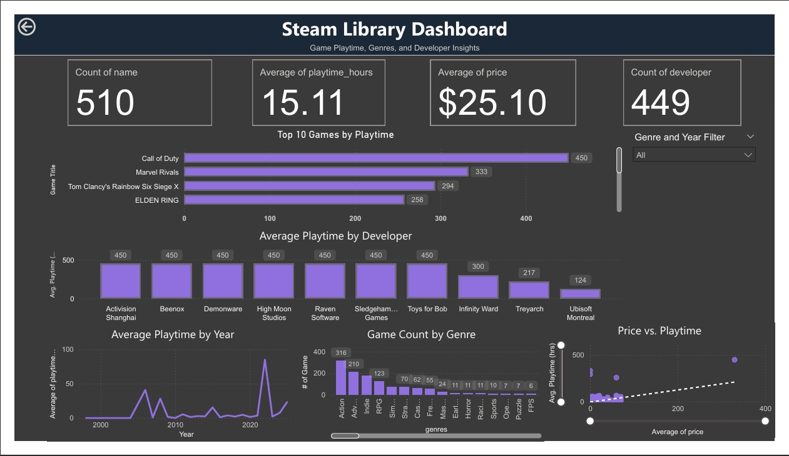

## Steam Library Dashboard

An interactive Power BI dashboard analyzing a personal Steam game library. This project demonstrates SQL data handling, DAX measures, and interactive visualizations to uncover insights about game playtime, genres, developers, and pricing trends. Perfect for showcasing data analytics and visualization skills.

---

## 📊 Project Overview

**Goal:**  
Analyze a Steam library to discover key insights about games, playtime, developers, genres, pricing trends, and release patterns.

**Data Source:**  
- CSV file containing game metadata: `name`, `playtime_hours`, `release_date`, `developer(s)`, `publisher(s)`, `genres`, `price`.

**Tools Used:**
- **Python**: Web scraping
- **Microsoft Excel**: Data cleaning
- **MySQL**: Data cleaning, aggregation, and querying  
- **Power BI**: Dashboard building, DAX measures, and interactive visualization  

---

## 🛠️ Data Cleaning & SQL Queries

1. **Normalized multi-value fields**  
   - Separated multiple developers, publishers, and genres into individual rows to ensure accurate aggregation.  
2. **Handled duplicate rows**  
   - Each game now appears once per developer/genre/publisher, and DISTINCTCOUNT / SUMX measures are used to avoid double-counting.  
3. **SQL Queries** included in the project:
   - Total games in library
   - Average playtime per game, per developer, per genre
   - Top developers by playtime
   - Release trends by decade
   - Price analysis
   - Complex queries using CTEs and partitions

> All SQL scripts are included in the mySQL file

---

## ✨ Power BI Dashboard Features

1. **Dynamic KPI Cards**  
   - Total Games, Total Playtime (hrs), Average Price, Unique Developers  
   - Updates automatically based on filters

2. **Top 10 Games & Developers by Playtime**  
   - Interactive bar charts highlighting library favorites

3. **Genre & Year Insights**  
   - Average playtime by genre  
   - Trends in playtime and game releases across decades

4. **Interactive Filters / Slicers**  
   - Slice by Genre, Developer, Release Year

---

## 🖼️ Dashboard Preview

  

---
